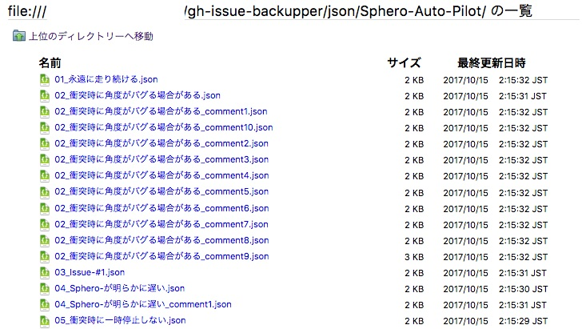

# gh-issue-backupper

Download issue and pull request log files as JSON

___

## Usage
Before use, you have to prepare `my_token.txt` and `repository_list.txt`.  
`my_token.txt` is where you write your OAuth token. OAuth is needed to access private repository.  
And you also have to write repository names you want to get log in `repository_list.txt`. For example:  
```
yammmt/sandbox
yammmt/Sphero-Auto-Pilot
```

After preparing above two files, open terminal and type followings:  
```bash
$ bundle install
$ ruby gh_issue_backupper.rb
```

And you'll get response:
```
make directory ./json/sandbox/...
0 issue & pull requests found

make directory ./json/Sphero-Auto-Pilot/...
24 issue & pull requests found
saving ./json/Sphero-Auto-Pilot/24_LICENSE-の取り扱い.json...
    saving ./json/Sphero-Auto-Pilot/24_LICENSE-の取り扱い_comment1.json...
    saving ./json/Sphero-Auto-Pilot/24_LICENSE-の取り扱い_comment2.json...
saving ./json/Sphero-Auto-Pilot/23_2016-03-19.json...
    saving ./json/Sphero-Auto-Pilot/23_2016-03-19_comment1.json...
    saving ./json/Sphero-Auto-Pilot/23_2016-03-19_comment2.json...
saving ./json/Sphero-Auto-Pilot/22_https:--github.com-comozilla-で本リポジトリ管理しませんか？.json...
    saving ./json/Sphero-Auto-Pilot/22_https:--github.com-comozilla-で本リポジトリ管理しませんか？_comment1.json...
    saving ./json/Sphero-Auto-Pilot/22_https:--github.com-comozilla-で本リポジトリ管理しませんか？_comment2.json...
...
    saving ./json/Sphero-Auto-Pilot/02_衝突時に角度がバグる場合がある_comment10.json...
saving ./json/Sphero-Auto-Pilot/01_永遠に走り続ける.json...

complete!
```


